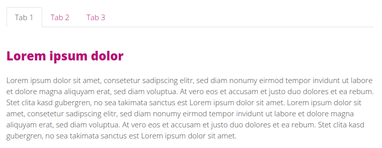
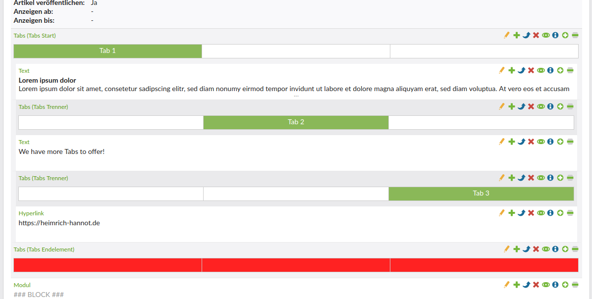

# Contao Tab Control Bundle

This Bundle brings Bootstrap 5 Tabs to Contao. 

## Features

- adds 3 new content elements: Start, Separator, Stop
- has the option to store last open tab in session (sessionStorage)
- migration command for migration from contao-legacy/fry_accessible_tabs
- [Encore Bundle](https://github.com/heimrichhannot/contao-encore-bundle) support

    

    

## Install

1. Install with composer: `composer require heimrichhannot/contao-tab-control-bundle`.
1. Update the database.

### Installation with Encore bundle

1. Run the symfony command `encore:prepare` and `yarn encore [dev|prod]` (you don't need to activate the entry manually if you use encore bundle version >= 1.3).

### Installation without Encore bundle

1. **Make sure bootstrap (js and style) is included** in your project setup since it **doesn't come with this bundle** to avoid duplicate code.

## Usage

1. This bundle brings three new content elements. To set up a tab section, choose the tab start element.
1. For each new tab add a tab separator element. The tab names are set in the tab start and the tab separator elements.
1. In the end add the tab stop element to wrap it up.

### Commands

`huh:tabcontrol:migrate`: Provide migration from contao-legacy/fry_accessible_tabs and older bundle version. See `huh:tabcontrol:migrate --help` for options.
